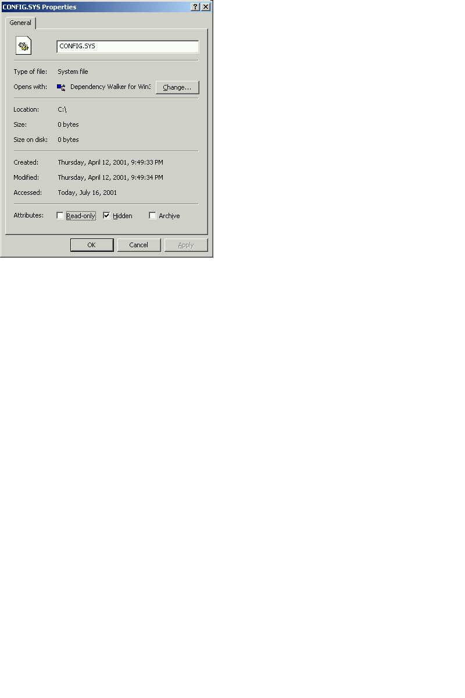

<div align="center">

## File Properties Dialog


</div>

### Description

Display a files property dialog box
 
### More Info
 


<span>             |<span>
---                |---
**Submitted On**   |
**By**             |[Russ Huebner](https://github.com/Planet-Source-Code/PSCIndex/blob/master/ByAuthor/russ-huebner.md)
**Level**          |Intermediate
**User Rating**    |5.0 (15 globes from 3 users)
**Compatibility**  |VB 4\.0 \(32\-bit\), VB 5\.0, VB 6\.0
**Category**       |[Miscellaneous](https://github.com/Planet-Source-Code/PSCIndex/blob/master/ByCategory/miscellaneous__1-1.md)
**World**          |[Visual Basic](https://github.com/Planet-Source-Code/PSCIndex/blob/master/ByWorld/visual-basic.md)
**Archive File**   |[](https://github.com/Planet-Source-Code/russ-huebner-file-properties-dialog__1-25086/archive/master.zip)


### Source Code

```
'SHELL EXECUTE FUNCTION
Declare Function ShellExecuteEx& _
Lib "Shell32.dll" Alias "ShellExecuteExA" _
 (ByRef lpExecInfo As SHELLEXECUTEINFO)
'Flag Needed
Const SEE_MASK_INVOKEIDLIST& = &HC
'SHELL EXECUTE STRUCT
Type SHELLEXECUTEINFO
 cbSize As Long
 fMask As Long
 hWnd As Long
 lpVerb As String
 lpFile As String
 lpParameters As String
 lpDirectory As String
 nShow As Long
 hInstApp As Long
 lpIDList As Long
 lpClass As String
 hkeyClass As Long
 dwHotKey As Long
 hIcon As Long
 hProcess As Long
End Type
'-------------------------------------------------'Procedure: ShowFileProperties(ByVal FileName$)
'Purpose: You can invoke the a files Property
'dialog box for a file with the
'ShellExecuteEx API.
'   In the SHELLEXECUTEINFO structure, set
'the SEE_MASK_INVOKEIDLIST flag and
'the "properties" verb as follows
'Input: ByVal FileName As String
'Output: File Properties Dialog Box
'-----------------------------------------------
Public Sub ShowFileProperties(ByVal FileNamePath)
Dim sei As SHELLEXECUTEINFO
 sei.cbSize = Len(sei)
 sei.lpFile = FileNamePath
 sei.lpVerb = "properties"
 sei.fMask = SEE_MASK_INVOKEIDLIST
 ShellExecuteEx sei
End Sub
'-------------------------------------------------
```

